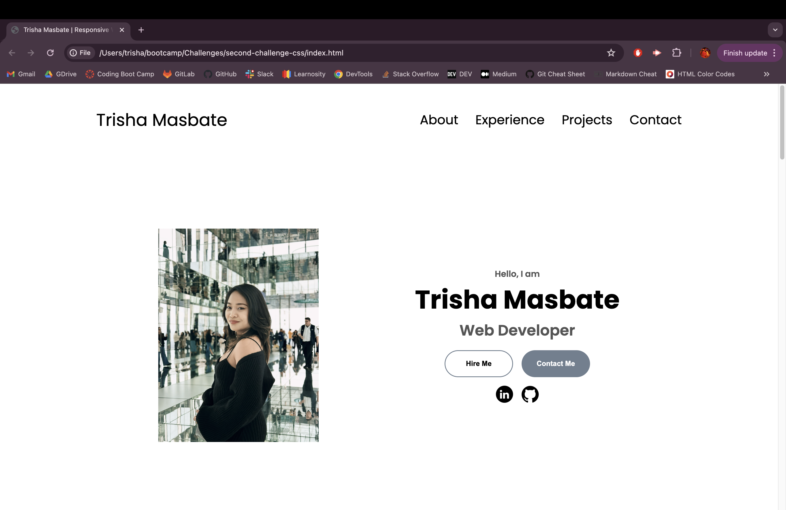

# 👩🏻‍💼 My Work Portfolio

## ✏️ Description

This portfolio is designed to showcase a potential web developer's previous work and provide easy access to relevant information.

It is structured to meet the following criteria:

- Developer's Information: Upon loading the portfolio, you will be presented with the developer's name, a recent photo, and links to sections about them, their work, and how to contact them.
  
- Navigation: Clicking on any link in the navigation will smoothly scroll the UI to the corresponding section.
  
- Work Section: Clicking on the link to the section about their work will lead you to a section with titled images of the developer's applications.
  
- Application Display: The first application's image will be larger in size than the others, providing emphasis.
  
- Application Deployment: By clicking on the images of the applications, you will be taken directly to the deployed application.
  
- Responsive Design: The portfolio is designed to offer a responsive layout that adapts seamlessly to various screen sizes and devices.


## ✏️ Installation and Usage

The navigation bars and buttons are responsive. These will direct you to sections of the page, featured projects, and other web applications as intended.

To run the Work Portfolio, you can start with either of these steps:

* Clone the repository:
```
git clone git@github.com:trishamasbate/second-challenge-css.git
```

* Use the link:
  
  [Trisha Masbate Web Portfolio](https://trishamasbate.github.io/second-challenge-css/)

Below is a preview of the web portfolio:




## ✏️ Credits

Credits to the following:

- Classmates
- TA and Instructors
- Slack Overflow
- Videos and Websites on Various Topics
  - [HTML & CSS Full Course](https://youtu.be/G3e-cpL7ofc?si=12bwDwgdpohK3NCh)
  - [Sample Portfolio Using only HTML and CSS](https://youtu.be/lgeoAUvoRJU?si=P0rQeqr_GEUlby08)
  - [Adding Images to GitHub README Files](https://youtu.be/Ljj1wGFJqPY?si=Q5DNDI0As-KIuGFV)
  - [In Depth Use of Advanced CSS](https://youtu.be/ldwlOzRvYOU?si=Xg0nKgwg7RCUyfKM)
  - [The Use of Media Query](https://youtu.be/KFJbIyqgGt0?si=weU8-aVaMyvkffUT)
  - [Source of Icons](https://www.flaticon.com/icons)
  - [Comprehensive Professional Profile](https://www.linkedin.com/in/trisha-kaye-masbate-845075203/)


## ✏️ License

This project is licensed under the [MIT License](https://opensource.org/licenses/MIT).


## ✏️ Contributing

If you have any ideas, suggestions, or bug reports, please feel free to open an issue or submit a pull request. Thank you so much! 💕